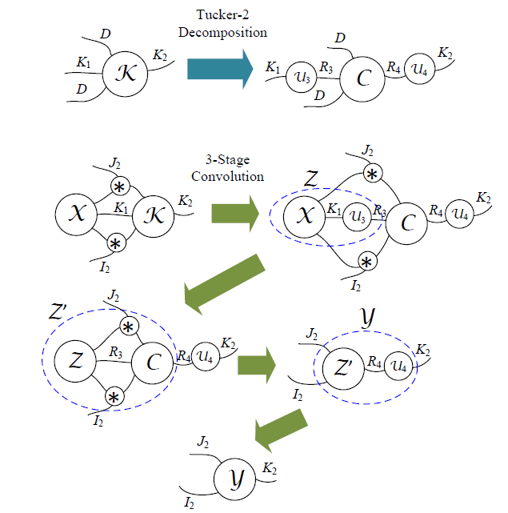
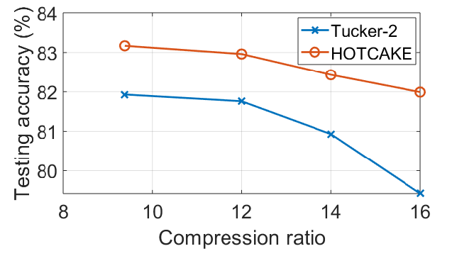

# HOTCAKE: Higher Order Tucker Articulated Kernels for Deeper CNN Compression ([Link](https://arxiv.org/abs/2002.12663))

## Idea

HOTCAKE is along the line of tensor decomposition and recognizes the unexploited rooms for deeper compression by going beyond 4-way.



## Advantages
+ HOTCAKE can compress not only bulky CNNs, but also compact and portable network models.
+ HOTCAKE reaches higher compression ratios with a graceful decrease of accuracy.
+ HOTCAKE can be selectively used for a better trade-off between accuracy and the number of parameters.
+ HOTCAKE is powerful yet flexible to be jointly employed with pruning and quantization.

## Citation
If you find HOTCAKE useful in your research, please consider citing:
```
@inproceedings{lin2020hotcake,
  title={HOTCAKE: Higher Order Tucker Articulated Kernels for Deeper CNN Compression},
  author={Lin, Rui and Ko, Ching-Yun and He, Zhuolun and Chen, Cong and Cheng, Yuan and Yu, Hao and Chesi, Graziano and Wong, Ngai},
  booktitle={2020 IEEE 15th International Conference on Solid-State \& Integrated Circuit Technology (ICSICT)},
  pages={1--4},
  year={2020},
  organization={IEEE}
}
```

## Comparison between Tucker-2 and HOTCAKE
|       | Tucker-2 | HOTCAKE |
|:----:|:----:|:----:|
| Data dimension | 4-way | beyond 4-way |
| Rank selection | VBMF | extended VBMF |
| Decomposition algorithm | HOSVD | HOSVD with rSVD |

VBMF: Variational Bayesian Matrix Factorization

HOSVD: Higher Order Singular Value Decomposition

rSVD: Random Singular Value Decomposition

## Runing Code
This code is tested on PyTorch 1.2 (cuda 9.2). To build the Environment, run:
```
pip install -r requirements.txt
```

We provide three different methods to initialize the small CONV layers after the decomposition:
+ ```./decomp/hotcake_random.py``` The small CONV layers are **randomly** initialized when giving the size of two input branches (k11, k12) and three Tucker ranks (r31, r32, r4).
+ ```./decomp/hotcake_rsvd.py``` The small CONV layers are initialized by **random SVD** when giving the size of two input branches (k11, k12) and three Tucker ranks (r31, r32, r4).
+ ```./decomp/hotcake_vbmf.py``` The small CONV layers are initialized by **VBMF** when giving the size of two input branches (k11, k12), while the three Tucker ranks will be calculated **automatically**.

In our implementation, we use ```./decomp/hotcake_vbmf.py``` to find the suggested Tucker ranks, and then use the ranks as the input of ```./decomp/hotcake_rsvd.py```.

### Demo on AlexNet @ CIFAR-10
HOTCAKE is a general compression approach, which can merge with other compression techniques like quantization, pruning, etc. Here, we show a demo of HOTCAKE on AlexNet @ CIFAR-10. The checkpoint of the original AlexNet on CIFAR-10 can be downloaded at [this link](https://drive.google.com/drive/folders/1Cp_9_5aGzfZA_vDsOC-3nae4mRVGIKAE?usp=sharing). The baseline is 90.17%. To implement HOTCAKE on the AlexNet, run:
```
python demo.py
```

### Get Your Own Implementation
If you want to use HOTCAKE on your own neural network, you can follow the steps below:
+ **Step 1:** Select the layers that need compression.
+ **Step 2:** Use VBMF to find the suggested ranks, and extend the rank combinations.
+ **Step 3:** Fix the ranks for different layers (e.g., ranks that can approximate the original tensor with the minimal error).
+ **Step 4:** Substitute the selected layers by HOTCAKE giving k11, k12, r31, r32 and r4.
+ **Step 5:** Fine-tune the compressed model.

## Core Codes
The proposed HOTCAKE:
```
def HighTKD2(conv_nn_module, k11, k12, r31, r32, r4):
    bias = conv_nn_module.bias
    stride = conv_nn_module.stride
    padding = conv_nn_module.padding
    conv = conv_nn_module.weight.detach().numpy()  # [K2, K1, kernel_size, kernel_size]
    conv = conv.transpose([2, 3, 1, 0])  # [kernel_size, kernel_size, K1, K2]
    dim_tensor = conv.shape  # [kernel_size, kernel_size, K1, K2]
    conv = conv.reshape(
        [dim_tensor[0], dim_tensor[1], k11, k12, dim_tensor[3]])  # [kernel_size, kernel_size, k11, k12, K2]

    conv_k11 = conv.transpose([2, 0, 1, 3, 4])  # [k11, kernel_size, kernel_size, k12, K2]
    conv_k11 = conv_k11.reshape([k11, -1])  # [k11, D*D*k12*k2]
    print('The rank of mode-k11: {}'.format(r31))
    start = time.clock()
    u3, s3, vt3 = simple_randomized_svd(conv_k11, k11)
    end = time.clock()
    print('The rank decided by randomized SVD: {}'.format(len(s3)))
    print('The time of randomized SVD: {}'.format(end - start))
    U3 = u3[:, 0:r31]  # [k11, r31]

    conv_k12 = conv.transpose([3, 0, 1, 2, 4])  # [k12, kernel_size,kernel_size, k11, K2]
    conv_k12 = conv_k12.reshape([k12, -1])
    print('The rank of mode-k12: {}'.format(r32))
    start = time.clock()
    u4, s4, vt4 = simple_randomized_svd(conv_k12, k12)
    end = time.clock()
    print('The rank decided by randomized SVD: {}'.format(len(s4)))
    print('The time of randomized SVD: {}'.format(end - start))
    U4 = u4[:, 0:r32]  # [k12, r32]

    conv_k2 = conv.transpose([4, 0, 1, 2, 3])  # [K2, kernel_size, kernel_size, k11, k12]
    conv_k2 = conv_k2.reshape([dim_tensor[3], -1])
    print('The rank of mode-k2: {}'.format(r4))
    u5, s5, vt5 = la.svd(conv_k2)
    U5 = u5[:, 0:r4]  # [k2, r4]

    conv_c = conv.transpose([2, 0, 1, 3, 4])  # [k11, kernel_size, kernel_size, k12, K2]
    conv_c = conv_c.reshape([k11, -1])
    conv_c = np.dot(U3.T, conv_c).reshape(
        [r31, dim_tensor[0], dim_tensor[1], k12, dim_tensor[3]])  # [r31, kernel_size, kernel_size, k12, K2]
    conv_c = conv_c.transpose([3, 1, 2, 0, 4])  # [k12, kernel_size, kernel_size, r31, K2]
    conv_c = conv_c.reshape([k12, -1])
    conv_c = np.dot(U4.T, conv_c).reshape(
        [r32, dim_tensor[0], dim_tensor[1], r31, dim_tensor[3]])  # [r32, kernel_size, kernel_size, r31, K2]
    conv_c = conv_c.transpose([4, 1, 2, 3, 0])  # [K2, kernel_size, kernel_size, r31, r32]
    conv_c = conv_c.reshape([dim_tensor[3], -1])
    conv_c = np.dot(U5.T, conv_c).reshape([r4, dim_tensor[0], dim_tensor[1], r31, r32])
    conv_c = conv_c.transpose([1, 2, 3, 4, 0])  # [kernel_size, kernel_size, r31, r32, r4]

    conv_k11 = U3.reshape([1, 1, U3.shape[0], r31])  # [1, 1, k11, r31]
    conv_k12 = U4.reshape([1, 1, U4.shape[0], r32])  # [1, 1, k12, r32]
    conv_c = conv_c.reshape(
        [dim_tensor[0], dim_tensor[1], r31 * r32, r4])  # [kernel_size, kernel_size, r31 * r32, r4]
    conv_k2 = U5.T.reshape([1, 1, r4, U5.shape[0]])  # [1, 1, r4, K2]
    return conv_k11, conv_k12, conv_k2, conv_c, bias, stride, padding
```

## Experimental Results

### SimpNet

|       | Original | Tucker-2 | HOTCAKE |
|:----:|:----:|:----:|:----:|
| **Testing Accuracy** | 95.21% | 90.84% | 90.95% |
| **Overall Parameters** | 5.48M | 2.24M | 1.75M |
| **Compression Ratio** | - | 2.45x | 3.13x |

[SimpNet](https://github.com/Coderx7/SimpNet) is a lightweight CNN. We notice that Tucker-2 and HOTCAKE achieve similar classification accuracy after fine-tuning, while HOTCAKE produces a more compact model.


This figure shows the classification accuracy of the compressed model obtained by employing HOTCAKE when increasing the number of compressed layers. The sequence we compress the layer is determined by their compression ratio listed in the following table. Employing this strategy, we can achieve the highest classification accuracy when the overall model compression ratio is given.

| CONV layer# | Original | Tucker-2 | HOTCAKE |
|:---:|:---:|:---:|:---:|
| 2 | 76K | 30K (2.53x) | 24K (3.17x) |
| 3 | 147K | 61K (2.41x) | 39K (3.77x) |
| 4 | 147K | 61K (2.41x) | 43K (3.42x) |
| 5 | 221K | 88K (2.72x) | 65K (3.40x) |
| 6 | 332K | 136K (2.44x) | 103K (3.22x) |
| 7 | 332K | 137K (2.42x) | 92K (3.61x) |
| 8 | 332K | 137K (2.42x) | 104K (3.19x) |
| 9 | 332K | 135K (2.46x) | 112K (2.96x) |
| 10 | 498K | 206K (2.42x) | 162K (3.07x) |
| 11 | 746K | 314K (2.37x) | 183K (4.08x) |
| 12 | 920K | 371K (2.48x) | 257K (3.58x) |
| 13 | 1.12M | 569K (1.97x) | 569K (1.97x) |

### MTCNN
[MTCNN](https://github.com/ipazc/mtcnn) is designed for human face detection. It contains three cascaded neural networks called P-Net, R-Net, and O-Net. The first two are too small such that we do not have much space to compress them. Therefore, we compress only the O-Net.

We achieved at least 3x compression ratio on all the three CONV layers even though the original layer sizes are already small enough.

| CONV layer# | Original | HOTCAKE |
|:---:|:---:|:---:|
| 2 | 18K | 4K (4.50x) |
| 3 | 37K | 8K (4.63x) |
| 4 | 33K | 11K (3.00x) |

The table below further illustrates the detailed performance of the compressed model. The performance of the MTCNN compresseed by HOTCAKE is almost the same as the original one.

|       | Original | HOTCAKE |
|:----:|:----:|:----:|
| Face Classification Accuracy | 95.36% | 94.42% |
| Loss of Face Detection | 0.648 | 0.686 |
| Loss of Bounding Box | 0.0137 | 0.0175 | 
| Loss of Face Landmarks | 0.0107 | 0.0128 |
| Total loss | 0.546 | 0.569 |

### AlexNet

AlexNet is much larger than the above two examples. The table below shows the layer-wise analysis of AlexNet. We observe that HOTCAKE can achieve higher compression ratio for each layer.

| CONV layer# | Original | Tucker-2 | HOTCAKE |
|:----:|:----:|:----:|:-----:|
| 2 | 307K | 127K (2.42x) | 56K (5.48x) |
| 3 | 664K | 197K (3.37x) | 120K (5.53x) |
| 4 | 885K | 124K (7.14x) | 51K (17.35x) |
| 5 | 590K | 71K (8.31x) | 34K (17.35x) |

We further show the classification performance of the compressed models. Tucker-2 obtains a higher accuracy when its compression ratio is half less than HOTCAKE.

|       | Original | Tucker-2 | HOTCAKE |
|:---:|:---:|:----:|:---:|
| Testing Accuracy | 90.86% | 90.29% | 83.17% |
| Overall Parameters (CONV layers) | 2.47M | 520K | 261K |
| Compression Ratio | - | 4.75x | 9.37x |

To make the comparison fair, we further set rnaks manually for Tucker-2 to reach the same compression ratio as HOTCAKE, and its classification accuracy drops from 90.29% to 81.39%, which is lower than that of HOTCAKE (83.17%). We assign ranks for both Tucker-2 and HOTCAKE, to reach higher compression ratios at aroung 12x, 14x, and 16x. The reulsts indicates that superiority of HOTACKE over Tucker-2 in high compression ratios.




## License
HOTCAKE is released under MIT License.

## Acknowledgements
We use [VBMF](https://github.com/jacobgil/pytorch-tensor-decompositions/tree/master/VBMF) and [rSVD](https://github.com/mp4096/rsvd) in our codes. We thanks for these open-source implementations.